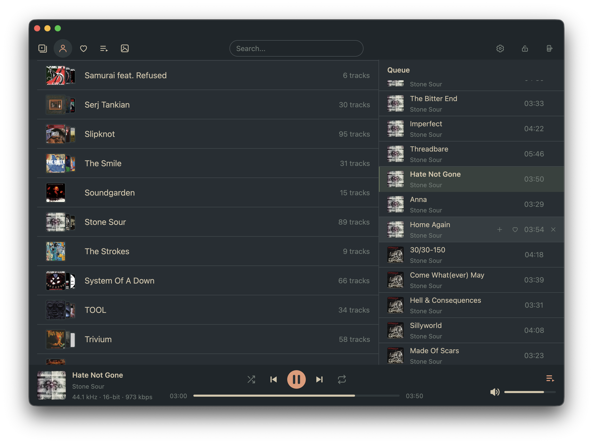
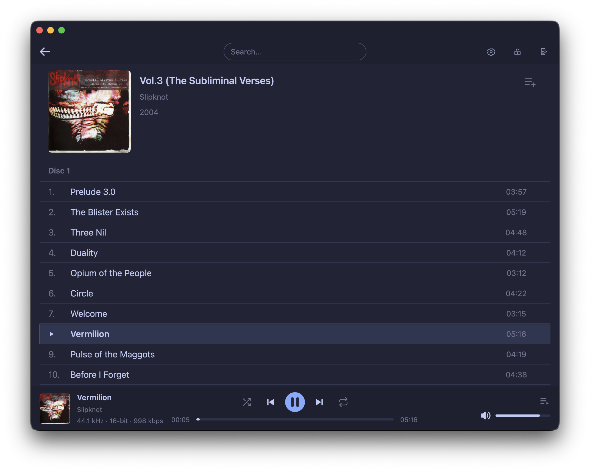
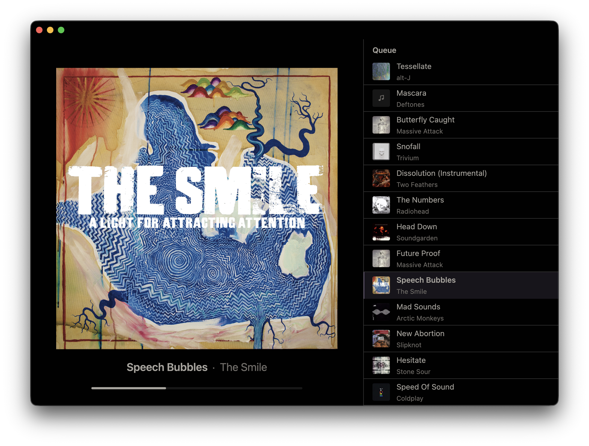
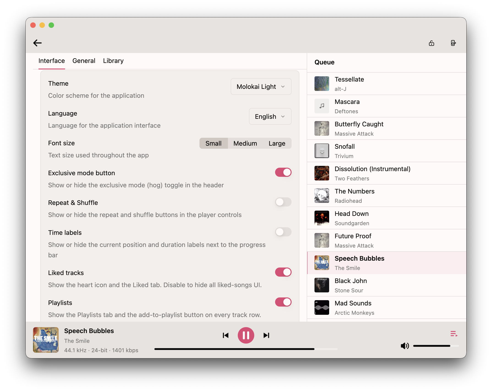

<div align="center">


# Pawse

**A fast, bit-perfect local music player built in Rust.**

Native, GPU-accelerated desktop player for your local library — a fluid 120+ fps interface
with exclusive (bit-perfect) output, CUE support, and playlists.

macOS · Windows · Linux

[Download](https://github.com/popovpsk/pawse/releases) · [Build from source](#building-from-source)

</div>

<table>
  <tr>
    <td width="50%"></td>
    <td width="50%"></td>
  </tr>
  <tr>
    <td width="50%"></td>
    <td width="50%"></td>
  </tr>
</table>

## Features

- **Bit-perfect playback** — sample-rate / bit-depth matching with a live bit-perfect status indicator, plus an **exclusive output mode** on Windows and macOS for an untouched signal path (not available on Linux).
- **Modern, fluid UI** — a clean, easy-to-use interface that stays smooth at 120+ fps.
- **Themes & languages** — 20+ built-in themes and 20 UI languages.
- **Wide format support** — FLAC, ALAC, MP3, WAV, OGG, and more.
- **Instant fuzzy search** — find any album, artist or track as you type.
- **Playlists & likes** — create, edit and drag-reorder playlists; like tracks.
- **System media integration** — control playback from your OS media controls and hardware media keys.
- **CUE sheets** — single-file albums are split into individual tracks automatically.

## Download

Grab the latest build from the [**Releases**](https://github.com/popovpsk/pawse/releases) page.

- **macOS** — move `Pawse.app` to Applications and open it. On first launch, if macOS blocks it, go to **System Settings → Privacy & Security** and click **Open Anyway**.
- **Windows** — in the SmartScreen dialog click *More info* → *Run anyway*.
- **Linux** — `chmod +x` the `.AppImage` and run it (recommended for smooth auto-updates), or install the `.deb`.

## Building from source

Requires a stable Rust toolchain (edition 2024).

```sh
cargo run --release
```

**macOS** — GPUI needs the Metal toolchain:

```sh
xcodebuild -downloadComponent MetalToolchain
```

**Linux** — install build dependencies first:

```sh
sudo apt-get install -y libasound2-dev libfontconfig-dev libwayland-dev \
  libxkbcommon-x11-dev build-essential cmake clang
```

## License

Licensed under the [MIT License](LICENSE).
