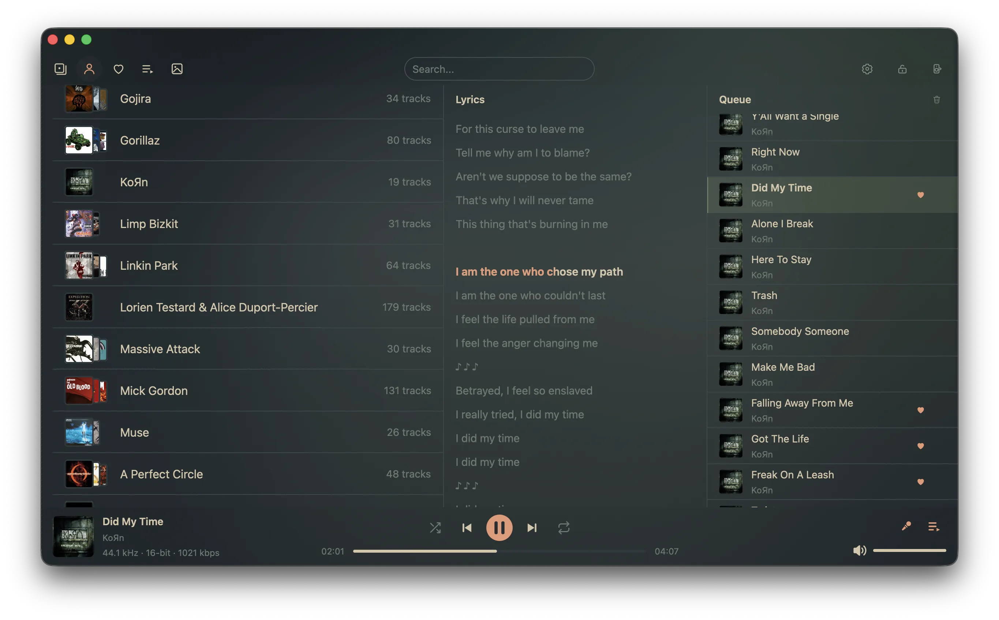
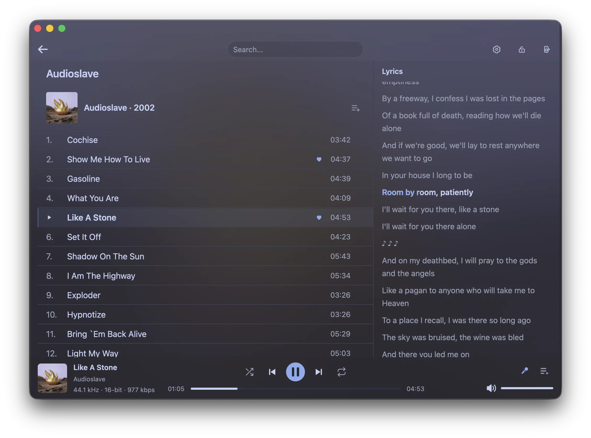
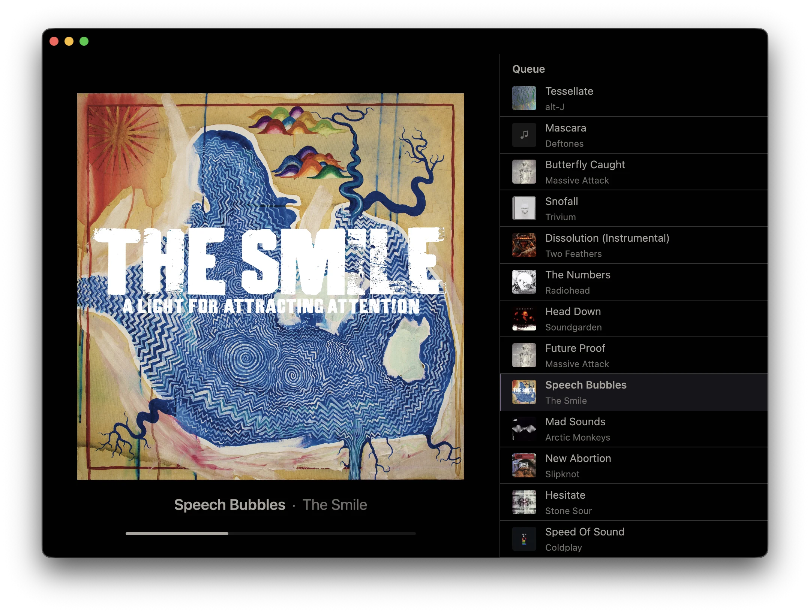
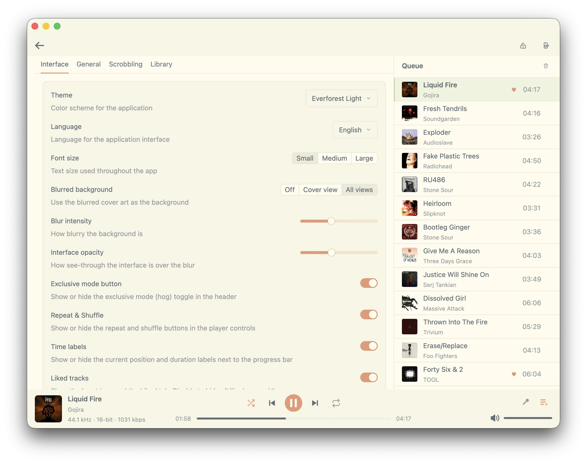
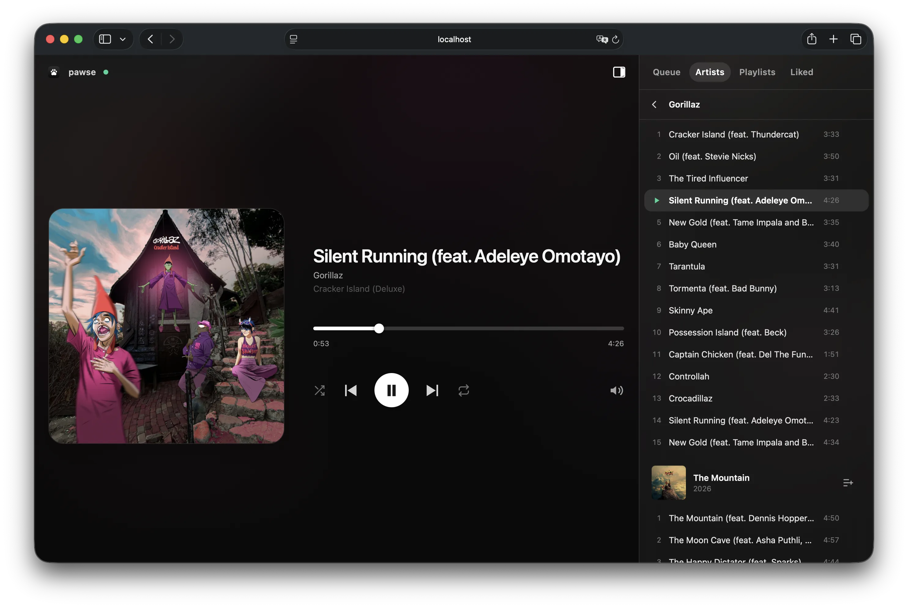
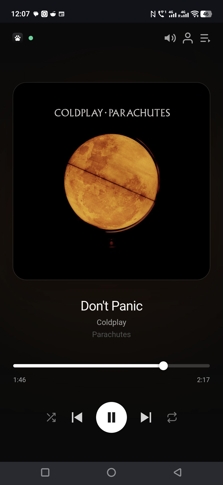

<div align="center">


# Pawse

**A fast, native music player for your local library, built in Rust and GPUI**, with a buttery-smooth, customizable 120+ fps interface, exclusive (bit-perfect) output, and a rich feature set.

macOS · Windows · Linux

[Download](#download) · [Build from source](#building-from-source)

</div>

<table>
  <tr>
    <td width="50%"></td>
    <td width="50%"></td>
  </tr>
  <tr>
    <td width="50%"></td>
    <td width="50%"></td>
  </tr>
</table>

<table>
  <tr>
    <td colspan="2" align="center"><b>Remote control</b> — desktop &amp; mobile</td>
  </tr>
  <tr>
    <td align="center"></td>
    <td align="center"></td>
  </tr>
</table>

## Features

- **Bit-perfect playback** — sample-rate / bit-depth matching with a live bit-perfect status indicator, plus an untouched signal path on every platform: **exclusive output** on Windows and macOS, and **native sample rate** on Linux.
- **Modern, fluid UI** — a clean, easy-to-use interface that stays smooth at 120+ fps.
- **Themes & languages** — 20+ built-in themes and 20 UI languages.
- **Wide format support** — FLAC, ALAC, MP3, WAV, OGG, DSD (DSF/DFF, decoded to PCM), and more.
- **CUE sheets** — single-file albums are split into individual tracks automatically.
- **Instant fuzzy search** — find any album, artist or track as you type.
- **Tag editor** *(beta)* — edit tags in your files, per track or album.
- **Lyrics** — time-synced lyrics from your files or fetched online.
- **Remote control** — control playback from any device on your network through a built-in HTTP web view.
- **System media integration** — control playback from your OS media controls and hardware media keys.
- **Last.fm & Discord** — scrobble everything you play to Last.fm, and show what you're listening to as your Discord status.
- **The little things** — click-free fades on pause and seek, artist grouping by album artist (with per-track fallback), keyboard shortcuts, a blurred cover backdrop, queue de-duplication, and a UI you can strip down element by element — small comforts that add up to a player you actually want to live in.

## Download

### macOS

**Apple Silicon (M1 and newer)** — [`arm64-dmg`](https://popovpsk.github.io/pawse/dl/macos-arm64)

Open the dmg and move `Pawse.app` to Applications. Builds are unsigned, so macOS blocks the first launch — clear it either way:

- Launch Pawse, then open **System Settings → Privacy & Security**, find the message about Pawse near the bottom and click **Open Anyway**.
- Or drop the quarantine flag from a terminal and launch normally:

  ```sh
  xattr -dr com.apple.quarantine /Applications/Pawse.app
  ```

After that it opens like any other app, and updates install themselves.

### Windows

|  | x64 *(almost every PC)* | ARM64 *(Snapdragon laptops)* |
|---|---|---|
| **Installer** *(recommended, self-updating)* | [`x64-installer`](https://popovpsk.github.io/pawse/dl/windows-x64) | [`arm64-installer`](https://popovpsk.github.io/pawse/dl/windows-arm64) |
| **Portable** — runs unpacked from anywhere | [`x64-portable`](https://popovpsk.github.io/pawse/dl/windows-x64-portable) | [`arm64-portable`](https://popovpsk.github.io/pawse/dl/windows-arm64-portable) |

Unsigned here too: in the SmartScreen dialog click *More info* → *Run anyway*. The portable zip never updates itself, so grab a new one when a release lands.

### Linux

|  | x86_64 | ARM64 |
|---|---|---|
| **AppImage** *(recommended, self-updating)* — one file, runs on any distro | [`x86_64-appimage`](https://popovpsk.github.io/pawse/dl/linux-x86_64-appimage) | [`arm64-appimage`](https://popovpsk.github.io/pawse/dl/linux-arm64-appimage) |
| **Debian package** — Debian, Ubuntu, Mint | [`x86_64-deb`](https://popovpsk.github.io/pawse/dl/linux-x86_64-deb) | [`arm64-deb`](https://popovpsk.github.io/pawse/dl/linux-arm64-deb) |
| **pacman package** — Arch, via `pacman -U` | [`x86_64-pacman`](https://popovpsk.github.io/pawse/dl/linux-x86_64-pacman) | [`arm64-pacman`](https://popovpsk.github.io/pawse/dl/linux-arm64-pacman) |

`chmod +x` the AppImage and launch it — it checks for new releases and updates itself. The `.deb` and pacman files are plain one-off packages, not a repository, so grab a new one when a release lands.

Prefer something your system manages?

**Flatpak** — signed and sandboxed, updated together with everything else. No self-update inside the app; it arrives with `flatpak update`.

```sh
flatpak install --user https://popovpsk.github.io/pawse/pawse.flatpakref
flatpak run io.github.popovpsk.pawse
```

**[AM](https://github.com/ivan-hc/AM)** catalog — `am -i pawse`, or `appman -i pawse` without root.

## Building from source

Requires a stable Rust toolchain (edition 2024).

```sh
cargo run --release
```

**macOS** — GPUI needs the Metal toolchain:

```sh
xcodebuild -downloadComponent MetalToolchain
```

**Linux** — install build dependencies first:

```sh
sudo apt-get install -y libasound2-dev libfontconfig-dev libwayland-dev \
  libxkbcommon-x11-dev build-essential cmake clang
```

## License

Licensed under the [MIT License](LICENSE).
