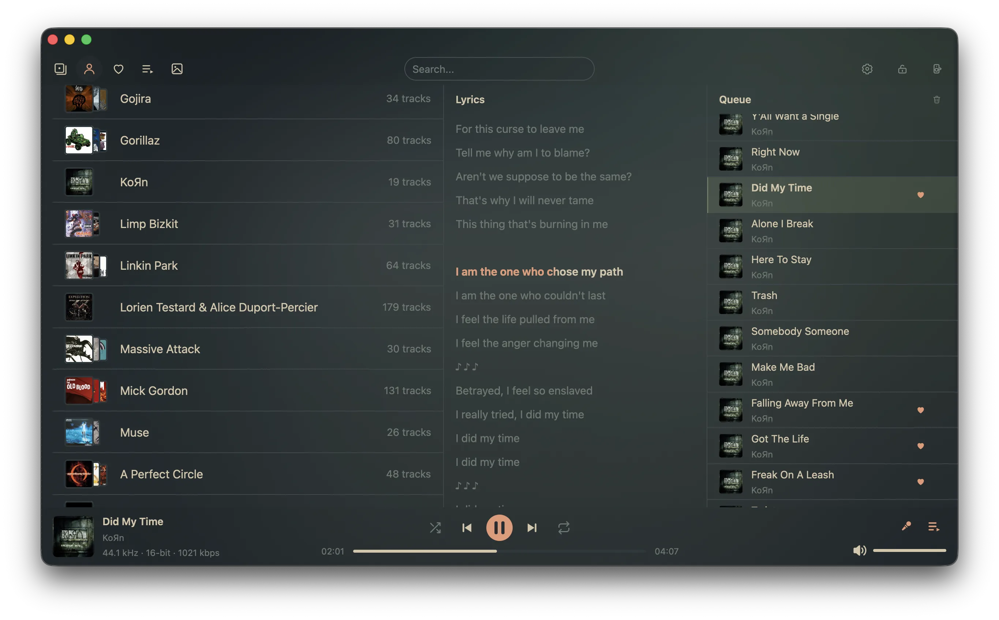
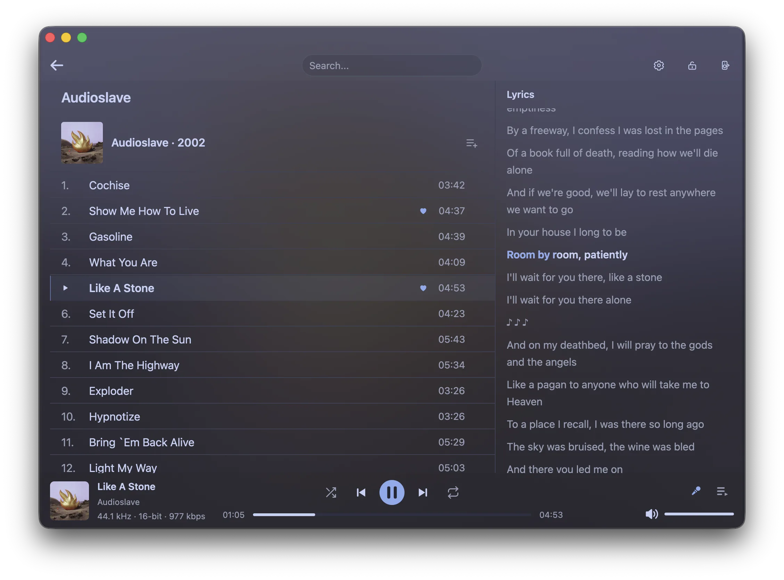
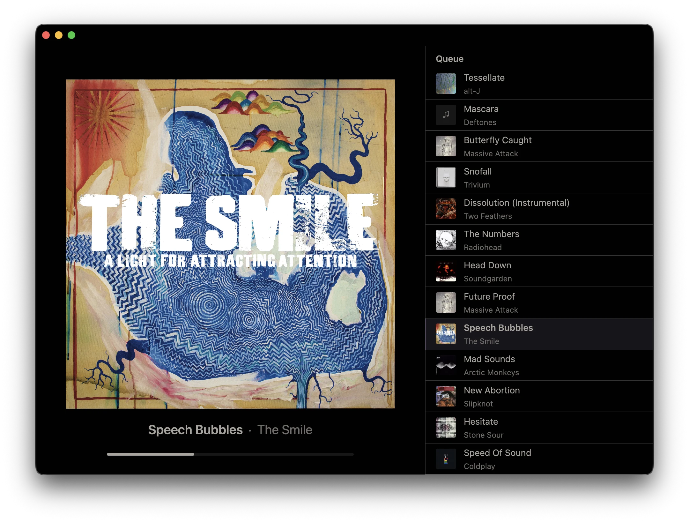
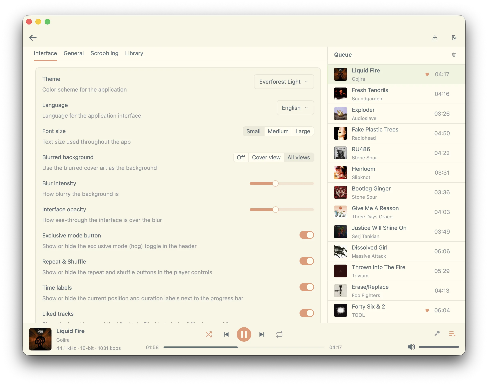
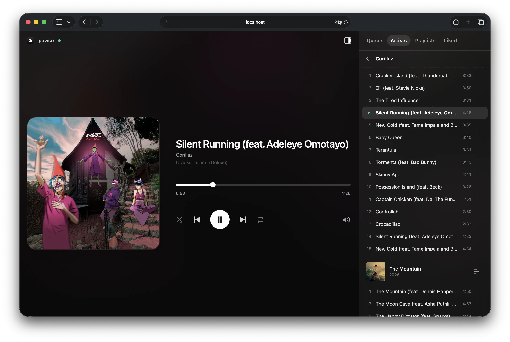
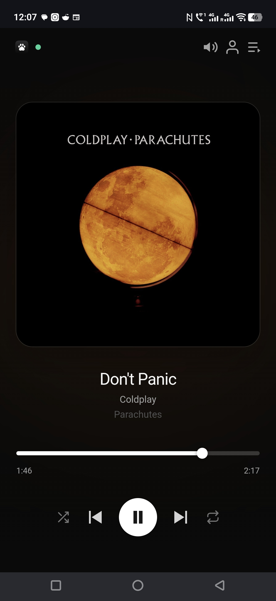

<div align="center">


# Pawse

**A fast, native music player for your library, built in Rust and GPUI**, with a buttery-smooth, customizable 120+ fps interface, exclusive (bit-perfect) output, and a rich feature set.

macOS · Windows · Linux

[Download](#download) · [Build from source](#building-from-source)

</div>

<table>
  <tr>
    <td width="50%"></td>
    <td width="50%"></td>
  </tr>
  <tr>
    <td width="50%"></td>
    <td width="50%"></td>
  </tr>
</table>

<table>
  <tr>
    <td colspan="2" align="center"><b>Remote control</b> — desktop &amp; mobile</td>
  </tr>
  <tr>
    <td align="center"></td>
    <td align="center"></td>
  </tr>
</table>

## Highlights

- **Bit-perfect playback** — **exclusive output** on Windows and macOS, **native sample rate** on Linux, with automatic sample-rate / bit-depth matching and a live bit-perfect indicator.
- **Fluid, minimal UI** — smooth at 120+ fps, 20+ themes plus an adaptive one that follows the cover art, 20 UI languages; hide any control, label or column you never use.
- **One library, many sources** — local files, Subsonic/Navidrome, Jellyfin, DLNA/UPnP servers and torrents, mixed into one library.
- **Cast anywhere** — AirPlay 1 & 2, Chromecast and DLNA renderers; switch outputs mid-track without losing your place.
- **Remote control** — a built-in web remote for any phone or browser on your network: player, queue and full library browsing.
- **Scrobbling** — Last.fm, Libre.fm, ListenBrainz and a local CSV log, all at once, with rewrite rules and loved-track sync.

## Everything you'd expect

- **Formats** — FLAC, ALAC, AAC, MP3, WAV, Ogg Vorbis, Opus, APE, DSD (DSF/DFF) and more; CUE sheets split into tracks; gapless playback and click-free fades.
- **Lyrics** — time-synced, with karaoke highlighting, from your files, LRCLIB or your media server.
- **Tag editor** — per track or per album.
- **System integration** — OS media controls, media keys, keyboard shortcuts, Discord status.
- **Sleep timer** and **automatic updates**.

## Download

### macOS

**Apple Silicon (M1 and newer)** — [`arm64-dmg`](https://popovpsk.github.io/pawse/dl/macos-arm64)

Open the dmg and move `Pawse.app` to Applications. Builds are unsigned, so macOS blocks the first launch — clear it either way:

- Launch Pawse, then open **System Settings → Privacy & Security**, find the message about Pawse near the bottom and click **Open Anyway**.
- Or drop the quarantine flag from a terminal and launch normally:

  ```sh
  xattr -dr com.apple.quarantine /Applications/Pawse.app
  ```

After that it opens like any other app, and updates install themselves.

### Windows

|  | x64 *(almost every PC)* | ARM64 *(Snapdragon laptops)* |
|---|---|---|
| **Installer** *(recommended, self-updating)* | [`x64-installer`](https://popovpsk.github.io/pawse/dl/windows-x64) | [`arm64-installer`](https://popovpsk.github.io/pawse/dl/windows-arm64) |
| **Portable** — runs unpacked from anywhere | [`x64-portable`](https://popovpsk.github.io/pawse/dl/windows-x64-portable) | [`arm64-portable`](https://popovpsk.github.io/pawse/dl/windows-arm64-portable) |

Unsigned here too: in the SmartScreen dialog click *More info* → *Run anyway*. The portable zip never updates itself, so grab a new one when a release lands.

### Linux

|  | x86_64 | ARM64 |
|---|---|---|
| **AppImage** *(recommended, self-updating)* — one file, runs on any distro | [`x86_64-appimage`](https://popovpsk.github.io/pawse/dl/linux-x86_64-appimage) | [`arm64-appimage`](https://popovpsk.github.io/pawse/dl/linux-arm64-appimage) |
| **Debian package** — Debian, Ubuntu, Mint | [`x86_64-deb`](https://popovpsk.github.io/pawse/dl/linux-x86_64-deb) | [`arm64-deb`](https://popovpsk.github.io/pawse/dl/linux-arm64-deb) |
| **pacman package** — Arch, via `pacman -U` | [`x86_64-pacman`](https://popovpsk.github.io/pawse/dl/linux-x86_64-pacman) | [`arm64-pacman`](https://popovpsk.github.io/pawse/dl/linux-arm64-pacman) |

`chmod +x` the AppImage and launch it — it checks for new releases and updates itself. The `.deb` and pacman files are plain one-off packages, not a repository, so grab a new one when a release lands.

**Flatpak** 

```sh
flatpak install --user https://popovpsk.github.io/pawse/pawse.flatpakref
flatpak run io.github.popovpsk.pawse
```

**[AM](https://github.com/ivan-hc/AM) catalog**

`am -i pawse`, or `appman -i pawse` without root.

## Building from source

Platform prerequisites and step-by-step instructions: [Building](.docs/building.md).

## License

Licensed under the [MIT License](LICENSE).
